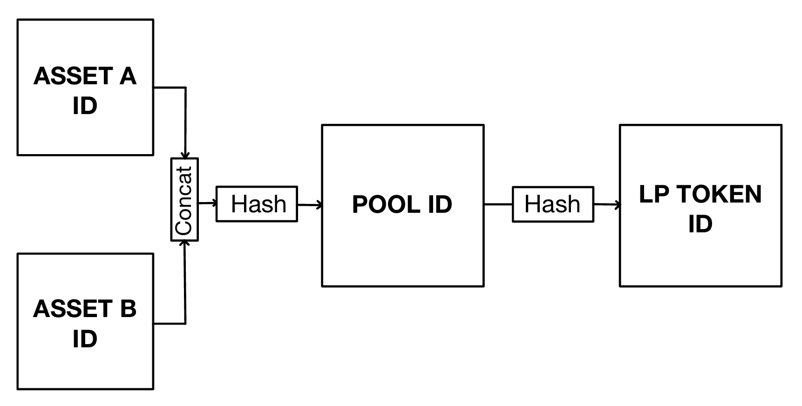
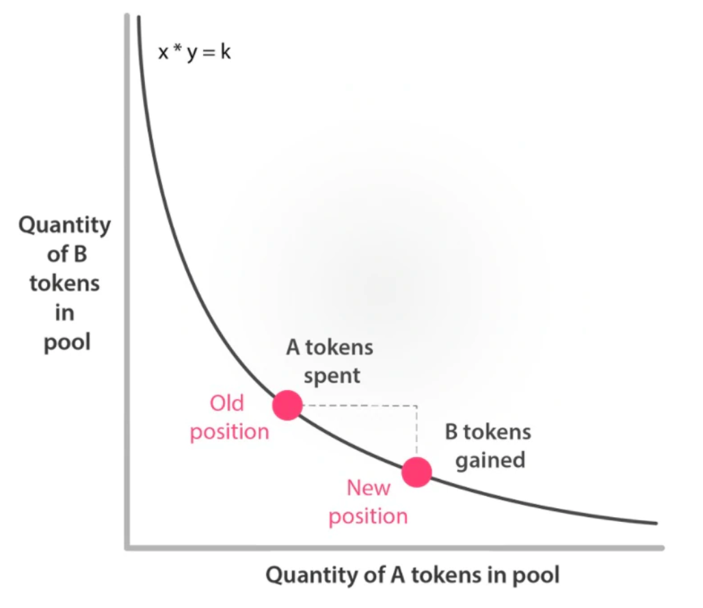

# Pallet DEX

My project is a new pallet - "pallet-dex".

- It is integrated into a working node.
- It is fully tested (bar some edge cases which I ran out of time to test) and built using test driven development.
- It is documented with documentation comments where applicable.
- I have tried to make it as readable as possible, though if I had more time I would refactor my code further. For example some of the functions accept a large number of parameters. This could be further refined.

## Features

My DEX with the following features:
- Create a liquidity pool for any two assets.
- Provide liquidity for any asset pair in exchange for LP (liquidity provider) tokens.
- Swap any two assets for which there exists a liquidity pool.
- Redeem LP tokens for your share of a pools assets, including a proportional share any accrued trading fees.

## Architecture

## Efficiency and Storage

When architecting my DEX, one of my primary concerns was performance. A DEX must be fast and efficient to run on blockchain without bloating the network and state.

Hence it must minimize calls to read and write from storage, and minimize the total amount of data stored.

With this in mind I designed a model where only the pallet-assets storage would be necessary.

This is possible by using the following model:



- A pool exists at a certain address called the `pool_id`
  - We can access this address by hashing together the id of any two assets.
- The LP tokens for a given pool are identified by the `lp_token_id`
  - We can access this by hashing the `pool_id`

We can always find the relevant pool and LP tokens for any given asset pair simply by hashing the asset ids.

This means that the only extra storage `pallet-dex` needs is that included in the `pallet-assets` pallet, which can be used to create, transfer and burn tokens using this model.

## DEX Mathematics

I used the constant product formula for handling DEX liquidity and pricing:

```
constant_product = initial_token_a_deposit * initial_token_b_deposit 
```

This constant product does not change for the lifetime of a pool.

We can then calculate the marginal price of an asset `a` at any time `t` by dividing the reserves of an asset `a` by the reserves of asset `b`.

p$^{t}$ = r$_{a}$ $^{t}$ / r$_{b}$ $^{t}$

The price is essentially a ratio of the volume of each asset in the pool, and the model relies on market arbitrage to ensure the price is always driven back to a normal market rate



We get the amount of lp_tokens provided to the initial liquidity provider by square rooting the constant product

```
lp_tokens_for_new_pool = sqrt(constant_product)
```

Furthermore, we calculate the lp token reward for following liquidity providers using the following formula:

```
lp_tokens_for_existing_pool = (amount_of_type_a_tokens_added / total_amount_of_type_a_tokens_in_pool) * current_total_lp_supply
```

Finally we can calculate a swap return of `a_tokens` tokens for `b_tokens` tokens using the following formula:

```
token_return = (starting_amount_of_b_tokens - (constant_product / new_total_amount_of_a_tokens_in_pool)) * (1 - pool_fee_percentage)
```


## What I didn't have time to do

THe following items I would have liked to do given more time:
- Further testing, particularly focusing on mathematic edge cases, which are a security risk to the protocol.
- Further refactoring of the code for simplicity, efficiency (sometimes storage is being read twice where it could be read once just via a reorganization of the code) and readability.
  - Readability particularly could be further improved in my `dex_math` functions, as they became quite ugly due to my defensive programming measures. This could be greatly improved upon.
- Benchmarking for all my extrinsics.
- Building a nice fancy front-end.

